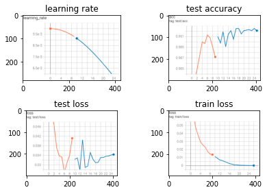

# minist手写数据集测试来实现程序中断后继续训练


模型的继续训练，即模型能够恢复到网络断开的前的状态，这就需要在训练过程中随时保存训练的状态。

## 1. pytorch 提供序列化接口

| 方法                | 描述                                                         |
| ------------------- | ------------------------------------------------------------ |
| torch.save（obj，f) | 将对象序列化，即将对象保存到本地磁盘上(我觉得任何对象都可以哦，我没试过哈哈哈) |
|                     | obj ：obj， 保存的对象<br/>f ：str， 保存地址                |
| torch.load( f )     | 将对象反序列化，即将对象读入内存当中                         |
|                     | f ：str， 读入地址                                           |

## 2. state_dict的导出和保存

模型，优化器，学习率schedule都提供了状态字典的导出和保存

| 方法                            | 描述                                                         |
| ------------------------------- | ------------------------------------------------------------ |
| **load_state_dict**(state_dict) | 加载优化器状态。                                             |
|                                 | **state_dict**–(dict) 优化器状态。应该是从调用返回的对象`state_dict()`。 |
| **state_dict**()                | 将优化器的状态作为dict.                                      |

## 3. 继续训练流程

[Minist-Demo-for-Resume-Train](https://github.com/JJBUP/Minist-Demo-for-Resume-Train) 一个完成的示例

**（1）模型断点的保存**

- **start_epoch**：中断后，保存的epoch将作为继续训练的开始。
  - start_epoch保存有利于SummerWriter等记录工具能够再从该epoch记录（注意：要想保存到同意文件需要在代码中是否是“中断后继续学习”进行判断和编写）
  - 有的代码learing_rate利用当前epoch计算，所以必须保存才能计算出该步的学习率
- **model_state_dict**：（必保存）网络模型状态字典，保存模型的参数等信息，感兴趣可以debug
- **optimizer_state_dict**：（必保存）优化器参数，由于优化器中可能存在随着epoch变化的值，所以必须保存
- **scheduler_state_dict**：学习率的计划表，如果使用学习率schedule则必须保存。

```python
state = {
     "start_epoch": epoch,
     "model_state_dict": net.state_dict(),
     "optimizer_state_dict": sgdOptimizer.state_dict(),
     "scheduler_state_dict": scheduler.state_dict(),
}
```

**（2）断点的加载**

```python
RESUME_PATH="......../state_dict_18.pth"
if RESUME_PATH:
    checkpoint = torch.load(RESUME_PATH)  # 加载断点
    
    start_epoch = checkpoint['epoch']+1  # 设置开始的epoch,新一轮+1
    net.load_state_dict(checkpoint['model_state_dict'])  # 加载模型可学习参数
    optimizer.load_state_dict(checkpoint['optimizer_state_dict'])  # 加载优化器参数
    scheduler_state_dict.load_state_dict(checkpoint['scheduler_state_dict'])

for epoch in  range(start_epoch ,EPOCH):
    pass
```

**（3）保证log工具能够继续书写**

以tensorboard为例子，若要保证显示完整曲线，则将SummaryWriter( log_dir =None )中log_dir 路径与中断前路径一致即可。

```python
from os import path
RESUME_PATH = "./log/2022-08-15_21-22-40/LenetMnist9.pt"
tensorboard_dir = path.split(RESUME_PATH)
writer = tensorboard.SummaryWriter(tensorboard_dir)
```

若我们使用不同地址，将会出现不同颜色曲线


