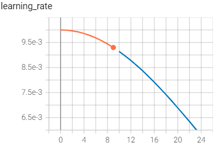
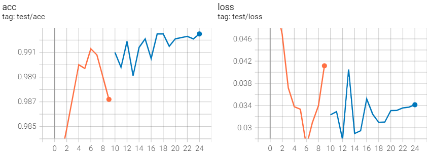
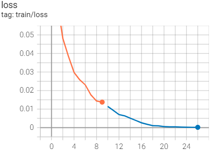

minist手写数据集测试来实现程序中断后继续训练


考虑如下部分

learing rate 变化，模型参数加载，重新开始的epoch 这几部分需要我们及时的保存，才能保证中断后训练的继续

```python
    state = {
        "start_epoch": epoch,
        "model_state_dict": leNet.state_dict(),
        "Optimizer_state_dict": sgdOptimizer.state_dict(),
        "scheduler_state_dict": scheduler.state_dict(),
    }
    torch.save(state, "./log/" + time_str + "/LenetMnist{0}.pt".format(epoch))
```

所以，中断后训练时需要加载该权重文件才能继续训练

```python
# ↑ 上面需要完成对 模型 ，学习率schedule ，优化器对象的初始化
# 判断是否继续训练
if RESUME_PATH:
    checkpoint = torch.load(RESUME_PATH)
    start_epoch = checkpoint["start_epoch"] + 1 # 新一轮的训练
    leNet.load_state_dict(checkpoint["model_state_dict"])
    sgdOptimizer.load_state_dict(checkpoint["Optimizer_state_dict"])
    scheduler.load_state_dict(checkpoint["scheduler_state_dict"])
else:
    start_epoch = 0
```

怎么保证tensorboard曲线完整呢？

其实，只要将后面加载的数据写到同一个文件夹中就能保证

如：

```python
from os import path
RESUME_PATH = "./log/2022-08-15_21-22-40/LenetMnist9.pt"
tensorboard_dir = path.split(RESUME_PATH)
writer = tensorboard.SummaryWriter(tensorboard_dir)
```
如果不将tensorboard 的log保存在同一个文件夹下，将是以下情景








具体应该保存什么应该看代码的形式，如没有schedule，而是根据epoch计算随时调整learing rate，这样只需要epoch即可
